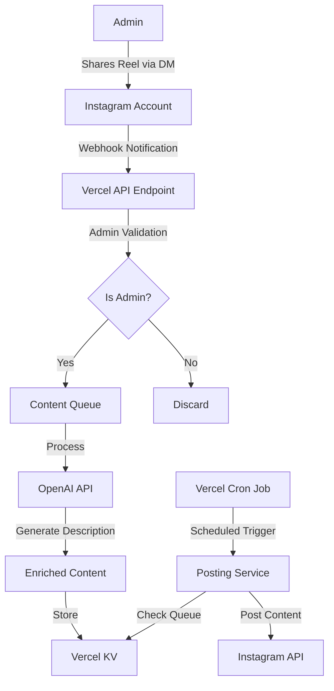

# Millennial Daddy System Patterns

## System Architecture

## Key Components

### 1. Webhook Handler
- Receives notifications from Instagram when DMs are received
- Validates sender against admin whitelist
- Extracts reel URL and metadata
- Adds valid submissions to content queue

### 2. Content Queue
- Implemented using Vercel KV
- Stores reel URLs, metadata, and processing status
- Maintains FIFO ordering for consistent posting

### 3. AI Description Generator
- Integrates with OpenAI API
- Analyzes reel content/metadata
- Generates engaging, brand-consistent descriptions
- Applies character limits for Instagram compatibility

### 4. Scheduled Posting Service
- Implemented as Vercel Cron Job
- Configurable posting interval via environment variables
- Retrieves next item from queue
- Posts content to Instagram via Graph API
- Updates queue status after successful posting

## Data Flow Patterns

### Content Ingestion Flow
1. Admin shares reel via Instagram DM
2. Webhook triggered with message payload
3. System validates admin permissions
4. Reel URL extracted and validated
5. Content added to processing queue

### Content Processing Flow
1. New queue item detected
2. Metadata extracted from reel
3. OpenAI API generates description
4. Enriched content stored back in queue
5. Item marked as ready for posting

### Content Publishing Flow
1. Cron job triggers at configured interval
2. System checks for ready items in queue
3. Oldest ready item selected for posting
4. Content posted via Instagram Graph API
5. Queue updated with posting status

## Error Handling Patterns

### API Failures
- Exponential backoff for transient errors
- Dead letter queue for persistent failures
- Admin notification for critical failures

### Content Validation
- URL format validation
- Content type verification (reels only)
- Duplicate detection

### Rate Limiting
- Instagram API rate limit tracking
- Adaptive posting schedule based on limits
- Queue throttling when approaching limits

## Security Patterns

### Admin Authentication
- Hardcoded whitelist of Instagram usernames
- Environment variable configuration
- No external authentication UI required

### API Security
- Secure storage of API credentials in Vercel environment
- Minimal permission scope for Instagram API
- OpenAI API key rotation policy
