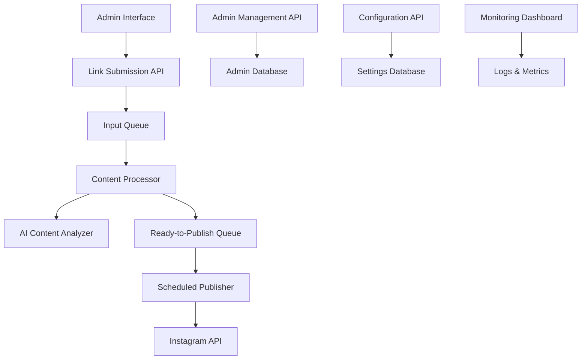

# Design Document

## Overview

The Video Link Queue Service is a serverless application designed to automate the curation and publishing of social media content. The system follows a queue-based architecture with separate processing stages for link ingestion, content analysis, and scheduled publishing. The design prioritizes cost-effectiveness by targeting Vercel's free tier while maintaining the flexibility to migrate to AWS if needed.

## Architecture

The system uses a serverless microservices architecture with the following key components:



### Core Components

1. **API Layer**: RESTful endpoints for link submission, admin management, and configuration
2. **Queue System**: Redis-based queues for asynchronous processing
3. **Content Processor**: Serverless functions for video analysis and enrichment
4. **Scheduler**: Cron-based system for automated publishing
5. **Storage Layer**: Database for configuration, admin management, and queue persistence
6. **External Integrations**: Instagram Graph API, YouTube Data API, TikTok API

## Components and Interfaces

### 1. Link Submission API

**Endpoint**: `POST /api/links`

**Interface**:

```typescript
interface LinkSubmissionRequest {
  url: string;
  submittedBy: string;
  timestamp: Date;
}

interface LinkSubmissionResponse {
  success: boolean;
  queueId: string;
  message: string;
}
```

**Responsibilities**:

- Validate admin authentication
- Parse and validate video URLs
- Add links to input queue
- Return submission confirmation

### 2. Content Processor

**Interface**:

```typescript
interface QueueItem {
  id: string;
  url: string;
  platform: "instagram" | "youtube" | "tiktok";
  submittedBy: string;
  timestamp: Date;
  status: "pending" | "processing" | "completed" | "failed";
}

interface ProcessedContent {
  id: string;
  originalUrl: string;
  platform: string;
  title: string;
  description: string;
  tags: string[];
  citation: string;
  thumbnailUrl?: string;
  processedAt: Date;
}
```

**Responsibilities**:

- Monitor input queue for new items
- Extract metadata from video platforms
- Generate AI-powered descriptions and tags
- Create proper citations
- Move processed content to ready-to-publish queue

### 3. Scheduled Publisher

**Interface**:

```typescript
interface PublicationConfig {
  frequency: "daily" | "multiple-daily" | "every-x-days";
  times: string[]; // HH:MM format
  interval?: number; // for every-x-days
  timezone: string;
}

interface InstagramPost {
  content: ProcessedContent;
  caption: string;
  hashtags: string[];
  storyContent: string;
  postContent: string;
}
```

**Responsibilities**:

- Execute scheduled publication jobs
- Format content for Instagram posts and stories
- Handle Instagram API authentication and posting
- Manage retry logic for failed publications
- Update queue status after successful posts

### 4. Admin Management System

**Interface**:

```typescript
interface Admin {
  id: string;
  email: string;
  name: string;
  isActive: boolean;
  createdAt: Date;
  lastActive?: Date;
}

interface AdminManagementAPI {
  addAdmin(admin: Omit<Admin, "id" | "createdAt">): Promise<Admin>;
  removeAdmin(adminId: string): Promise<boolean>;
  listAdmins(): Promise<Admin[]>;
  validateAdmin(email: string): Promise<boolean>;
}
```

### 5. Configuration Management

**Interface**:

```typescript
interface SystemConfig {
  publication: PublicationConfig;
  instagram: {
    accessToken: string;
    accountId: string;
  };
  processing: {
    maxRetries: number;
    timeoutMs: number;
  };
}
```

## Data Models

### Database Schema

**Admins Table**:

```sql
CREATE TABLE admins (
  id UUID PRIMARY KEY,
  email VARCHAR(255) UNIQUE NOT NULL,
  name VARCHAR(255) NOT NULL,
  is_active BOOLEAN DEFAULT true,
  created_at TIMESTAMP DEFAULT NOW(),
  last_active TIMESTAMP
);
```

**Queue Items Table**:

```sql
CREATE TABLE queue_items (
  id UUID PRIMARY KEY,
  url TEXT NOT NULL,
  platform VARCHAR(50) NOT NULL,
  submitted_by VARCHAR(255) NOT NULL,
  status VARCHAR(50) DEFAULT 'pending',
  queue_type VARCHAR(50) NOT NULL, -- 'input' or 'ready_to_publish'
  content JSONB, -- processed content data
  created_at TIMESTAMP DEFAULT NOW(),
  processed_at TIMESTAMP,
  published_at TIMESTAMP
);
```

**System Configuration Table**:

```sql
CREATE TABLE system_config (
  key VARCHAR(255) PRIMARY KEY,
  value JSONB NOT NULL,
  updated_at TIMESTAMP DEFAULT NOW()
);
```

### Queue Data Structures

**Redis Queue Structure**:

- `input_queue`: List of pending video URLs to process
- `ready_to_publish_queue`: List of processed content ready for publication
- `failed_queue`: List of items that failed processing (for manual review)

## Error Handling

### Processing Errors

1. **URL Validation Failures**:

   - Return immediate error response to admin
   - Log invalid URL attempts for monitoring

2. **Content Extraction Failures**:

   - Retry up to 3 times with exponential backoff
   - Move to failed queue after max retries
   - Send notification to system administrator

3. **AI Processing Failures**:
   - Fallback to basic metadata extraction
   - Use default tags if AI tagging fails
   - Continue processing with available data

### Publishing Errors

1. **Instagram API Failures**:

   - Respect rate limits with exponential backoff
   - Retry failed posts up to 3 times
   - Queue posts for next available time slot

2. **Authentication Failures**:
   - Refresh Instagram access tokens automatically
   - Alert administrator if refresh fails
   - Pause publishing until credentials are updated

### System Resilience

1. **Queue Persistence**:

   - Use Redis with persistence enabled
   - Backup queue state to database periodically
   - Implement queue recovery on service restart

2. **Graceful Degradation**:
   - Continue basic operations if AI services fail
   - Provide manual override for critical functions
   - Maintain service availability during partial outages

## Testing Strategy

### Unit Testing

1. **API Endpoints**:

   - Test all CRUD operations for admin management
   - Validate URL parsing and platform detection
   - Test authentication and authorization logic

2. **Content Processing**:

   - Mock external API responses for consistent testing
   - Test content enrichment algorithms
   - Validate queue operations and state transitions

3. **Publishing Logic**:
   - Test Instagram API integration with mock responses
   - Validate scheduling and timing logic
   - Test retry mechanisms and error handling

### Integration Testing

1. **End-to-End Workflows**:

   - Test complete link submission to publication flow
   - Validate queue processing under load
   - Test configuration changes and their effects

2. **External API Integration**:
   - Test with real Instagram API in staging environment
   - Validate content extraction from actual video URLs
   - Test rate limiting and error handling with real APIs

### Performance Testing

1. **Queue Processing**:

   - Test processing capacity and throughput
   - Validate memory usage within Vercel limits
   - Test concurrent processing scenarios

2. **Scheduling Accuracy**:
   - Test publication timing accuracy
   - Validate timezone handling
   - Test schedule changes and their immediate effects

### Deployment Testing

1. **Vercel Deployment**:

   - Test function cold starts and warm-up times
   - Validate environment variable configuration
   - Test database connections and persistence

2. **AWS Migration Path**:
   - Test deployment scripts for AWS Lambda
   - Validate RDS/DynamoDB integration
   - Test CloudWatch monitoring and alerting

## Platform-Specific Considerations

### Vercel Free Tier Limitations

1. **Function Execution Time**: 10-second limit for serverless functions

   - Break content processing into smaller chunks
   - Use async processing for long-running tasks
   - Implement continuation patterns for complex operations

2. **Memory Limits**: 1024MB maximum per function

   - Optimize content processing algorithms
   - Use streaming for large data operations
   - Implement garbage collection strategies

3. **Request Limits**: 100GB bandwidth per month
   - Optimize API response sizes
   - Implement efficient caching strategies
   - Monitor usage to prevent overages

### AWS Alternative Architecture

1. **Lambda Functions**: For serverless processing
2. **SQS**: For queue management
3. **RDS/DynamoDB**: For data persistence
4. **CloudWatch**: For monitoring and logging
5. **EventBridge**: For scheduling and automation

This design provides a robust, scalable foundation for the Video Link Queue Service while maintaining cost-effectiveness and operational simplicity.
